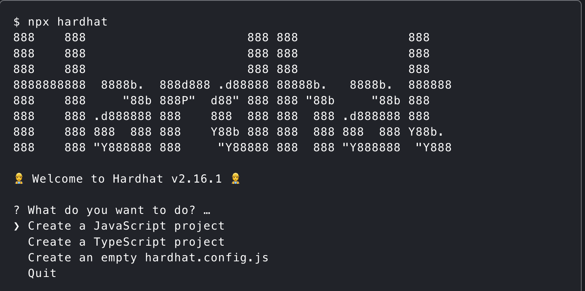

## Creazione del progetto

Nel progetto viene utilizzato hardhat come ambiente di sviluppo ethereum e come testnet.

### Installazione di harhdat

Aprite una shell e digitate i seguenti comandi:

1. Create una cartella di nome tokenHardhat

   > mkdir tokenHardhat

2. Entrate nella cartella da terminale

   > cd tokenHardhat

3. Create un nuovo progetto
   > npm init


Dopo aver fatto npm init vi chiederà il package name e le altre voci che vedete nel terminale, cliccate su invio per tutte le voci per creare il progetto.

4. Create un nuovo progetto hardhat:
   > npx hardhat



Create un nuovo progetto javascript, e cliccate su invio a tutte le domande dopo, che, ovviamente non ricordo perché non me le sono segnate

5. Installate @nomicfoundation/hardhat-ethers, questo plugin porta su Hardhat la libreria Ethereum `ethers.js`, che permette di interagire con la blockchain di Ethereum in modo semplice

   > npm i @nomicfoundation/hardhat-ethers

6. Installate @openzeppelin/contracts, verrà usato per scrivere il token
   > npm i @openzeppelin/contracts

Ora abbiamo un progetto hardhat

### Struttura del progetto

1. **contracts**: creerete in questa cartella il contratto del token, inizialmente troverete un Lock.sol (potete eliminarlo)
2. **scripts**: dentro questa cartella c'è il file per il deploy del contratto
3. **test**: qui dentro creerete i file per fare gli unit test dei contratti, inizialmente troverete Lock.js e potete eliminarlo

## Creazione del token

Per creare il token copiate e incollate quello che c'è in **Excentio.sol**, potete cambiare il nome del token e il simbolo dentro il costruttore di ERC20.

**Qui mettere spiegazione del contratto del token**

## Test token con unit test

Per testare il token potete copiare e incollare gli unit test che sono presenti nel file **ExcToken.js** nella cartella test

> npx hardhat test

Con questo comando, verrà deployato il contratto e verranno testati i metodi che sono presenti nel file del contratto.

## Deploy token su testnet

Per deployare il token su una testnet dovete:

1. Runnare questo comando in un nuovo terminale del progetto

   > npx hardhat node
   > 

2. Aggiungere una network dentro il file hardhat.config.js

```
networks: {
	hardhatNet: {
		url: "indirizzo del server",
		accounts: ["la chiave privata del primo account"],
		chainId: 31337,
	},
},
```

La chiave privata del primo account la trovate negli accounts che vengono generati dopo aver runnato il comando del punto 1
L'indirizzo del server lo trovate nella linea verde, dopo server at.
La chainId di hardhat è 31337.

Ora dobbiamo deployare il contratto.

3. Deploy del contratto:

   Copiate ciò che c'è in deploy.js dentro e incollatelo nel vostro file deploy.js.
   Questo script ci consente di deployare il contratto e prenderne l'indirizzo per poi inserire il token su metamask.

4. Runnate su un nuovo terminale il seguente comando:

   > npx hardhat run --network hardhatNet scripts/deploy.js

   Questo comando specifica la network da utilizzare e quale file deve usare per il deploy.

   Verrà stampato a terminale questo messaggio:
   EXC deployed at (indirizzo)
   Copiate tutto l'indirizzo e tenetevelo da qualche parte che ci serve per metamask

Il contratto ora è deployato sulla tesnet di hardhat

## Importare token su metamask

Installate l'estensione di metamask su google e registratevi.

Cliccate su Rete ethereum principale e cliccate show/hide test network:


Attivate e vedrete le test net.

Ora dovete aggiungere la testnet di hardhat quindi andate in impostazioni>Reti e cliccate su Aggiungi una rete.

Aggiungere una rete manualmente con questi valori:


Salvate e cambiate network.

Importate due account della vostra testnet cliccando sul vostro account e incollate le due chiavi private.
Ora potete importare il token sui vostri due account:
Cliccate su import tokens e incollate l'indirizzo del contratto che avete deployato (quello che dovevate salvare prima), importate il token e lo vedrete sulla pagina principale.
